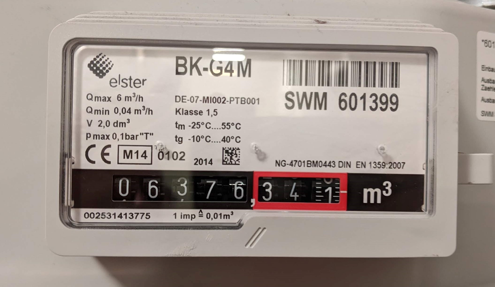

# Gas-meter OCR
The goal is to take pictures from the gas-meter and read the actual values using OCR (optical character recognition)

## Project organization
- Folders starting with `opencv_` contain [OpenCV](https://docs.opencv.org/4.x/index.html) basics and tutorials.
- Folders starting with `gas_meter_` contain actual working scripts for the gas-meter problem. 

## ToDos
- Try `find_black_boxes` algorithm on sharp smartphone images
- Improve camera sharpness
- Try [scikit-image](https://scikit-image.org/) as `opencv` alternative
- Check-out [The gas meter image dataset (NRC-GAMMA)](https://nrc-digital-repository.canada.ca/eng/view/object/?id=ba1fc493-e65f-4c0a-ab31-ecbcdf00bfa4)
- Compare to [erkexzcx/gas_monitor](https://github.com/erkexzcx/gas_monitor) solution
- https://raspberrypi-guide.github.io/electronics/using-usb-webcams
- https://raspberrypi-guide.github.io/programming/install-opencv.html
